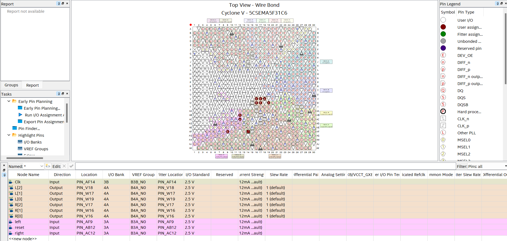

# 🚗 Thunderbird Hazard Light  
*A digital hazard light system for the Thunderbird, built with FPGA technology!*  


<p align="center">
    
    
    
</p>

---

## 🚀 Project Overview  
This FPGA-based hazard light system is designed for **Ford Thunderbird vehicles**, providing:  
✅ **Synchronized blinking** hazard lights  
✅ **Adjustable timing** for light blinking  
✅ **Low power consumption**  
✅ **Customizable logic for future enhancements**  

---

## 📂 Project Structure  
📁 thunderbird-hazard-light ├── 📂 src # Source code (Verilog/VHDL) ├── 📂 simulation # Testbenches & waveform analysis ├── 📂 docs # Design documentation & schematics ├── 📂 output_files # Quartus generated files ├── 📜 project.qpf # Quartus Project File ├── 📜 project.qsf # Quartus Settings File ├── 📜 README.md # This README file


---

## 🔧 Setup & Installation  
### **1️⃣ Clone the Repository**
```sh
git clone https://github.com/andreyp3054/thunderbird-hazard-light.git
cd thunderbird-hazard-light

```
### 2️⃣ Open in Quartus  
Open project.qpf in Intel Quartus Prime.  
Compile the project by clicking Start Compilation.  
Run simulations in ModelSim/Questa if needed.  

### 3️⃣ Upload to FPGA  
Connect your FPGA board.  
Use Quartus Programmer to upload the bitstream.  

### 🎯 Usage  
🔹 Simulation  
vsim -do run_test.do  
Open ModelSim/Questa and load testbench.sv.  
Run waveform analysis.  

🔹 Hardware Deployment
Flash the .sof file onto your FPGA using Quartus Programmer.  
Connect the system to the Thunderbird hazard light circuit.  
Verify synchronized blinking.  

## 📌 Pin Configuration
| **Pin Name** | **Function** | **Description** |
|-------------|-------------|----------------|
| Clk       | Clock Input  | Provides the system clock signal. |
| reset     | Reset Input  | Resets the hazard light system. |
| left      | Left Signal Light | Controls the left turn indicator. |
| right     | Right Signal Light | Controls the right turn indicator. |
| [2:0]  L  | Left Signal Output LEDs | Represents the left signal lights blinking LEDS. |
| [2:0]  r  | Right Signal Output LEDs | Represents the right signal lights blinking LEDS. |
**Hazard light activates when both left and right switches are true.**

  

## 📸 Screenshots & Diagrams  

## ⚙️ Technologies Used  
FPGA Toolchain: Intel Quartus Prime  
Languages: Verilog / VHDL  
Simulation: ModelSim / Questa  
Hardware: FPGA & Thunderbird electrical system  

## 🛠️ To-Do List  
 Create an algorithm for the hazard pattern in thunderbird  
 Create a wrapper file to map the params to pins  
 Create and integrate clock divider file to decrease LED blinking speed  
 Implement the code in FPGA with correct LED pins  

## 📜 License  
This project is for educational purposes only. The **clock divider file** was provided by Professor Stephen Haim from MSU-IIT, along with the lab activity manual and the hardware resources. The **algorithm for the hazard blinking pattern** was developed by me, while the remaining code files were created collaboratively by my partner and me.

## 💬 Contact  
📧 Email: markandrey.acebu@gmail.com  
🔗 LinkedIn: Mark Andrey Acebu  
